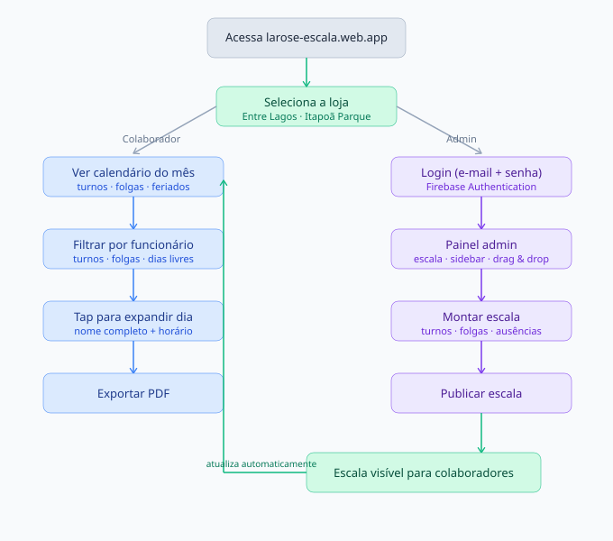
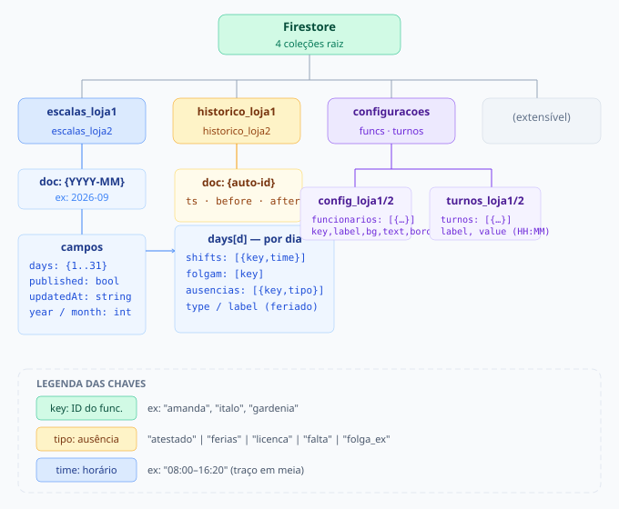

# 🌹 La Rose · Escala Online

Sistema de gestão de escalas de trabalho para a **La Rose Hortifruti** — duas lojas, painel público para colaboradores e painel administrativo completo para o gestor.

🔗 **Produção:** [larose-escala.web.app](https://larose-escala.web.app)

---

## 📸 Telas do sistema

### Seleção de loja


### Painel do colaborador


### Filtro por funcionário


### Painel administrativo


---

## 🔄 Fluxo do sistema



---

## ✨ Funcionalidades

### Painel do colaborador — público
- Seleção de loja a cada acesso (Entre Lagos · Itapoã Parque)
- Calendário mensal com nome e horário de cada turno
- Filtro por colaborador — resumo individual com total de turnos, folgas e dias livres
- **Mobile:** toque para expandir o dia e ver todos os horários
- Feriados nacionais e do DF com destaque vermelho
- Ausências com badges coloridos: 🏥 Atestado · ✈️ Férias · 📋 Licença · ⚠️ Falta · ⭐ Folga extra
- Exportar PDF com legenda completa e cores preservadas
- Responsivo: desktop, tablet e mobile (portrait + landscape)

### Painel administrativo — autenticado
- Login com e-mail e senha (Firebase Authentication)
- Gerenciamento independente por loja
- **Drag & drop** no desktop — arrastar funcionário ou turno para o dia
- **Tap de dois toques** no mobile — selecionar item e depois o dia
- Copiar dia para outro dia (substituir ou mesclar conteúdo)
- Copiar escala do mês anterior
- Padrão semanal — preencher semana inteira de uma vez
- Gerenciar turnos: criar, renomear e deletar com horários personalizados
- Gerenciar equipe: adicionar e remover funcionários com paleta de 12 cores
- Feriados detectados via BrasilAPI + feriados municipais do DF
- Alertas CLT automáticos: folga semanal, descanso mínimo 11h, domingos consecutivos
- Horas extras calculadas por funcionário no mês
- Rascunho salvo automaticamente — publicação manual
- Histórico de alterações com log antes/depois
- Arquivo de escalas anteriores com exportação PDF e CSV
- Troca de turno entre funcionários com registro
- Exportar PDF com cabeçalho, legenda e cores

---

## 🛠 Stack

| Camada | Tecnologia |
|---|---|
| Frontend | HTML5 · CSS3 · JavaScript ES Modules — sem frameworks |
| Autenticação | Firebase Authentication |
| Banco de dados | Cloud Firestore |
| Hospedagem | Firebase Hosting |
| Fontes | Plus Jakarta Sans (Google Fonts) |
| Feriados | [BrasilAPI](https://brasilapi.com.br) `feriados/v1/{ano}` |
| PWA | `manifest.json` + ícones SVG |

> **Pure vanilla** — sem Node.js runtime, sem bundler, sem build step. Deploy direto da pasta `public/`. Toda a lógica é JavaScript ES Modules nativo no browser.

---

## 📁 Estrutura de arquivos

```
ESCALA-ONLINE/
├── .firebase/                       # Cache do Firebase CLI — ignorado pelo Git
├── docs/                            # Screenshots e diagramas para o README
│   ├── login.png
│   ├── colaborador.png
│   ├── filtro-colaborador.png
│   ├── admin.png
│   ├── fluxo-app.svg
│   └── firestore-schema.svg
├── public/
│   ├── assets/
│   │   ├── icons/
│   │   └── images/
│   ├── css/
│   │   ├── main.css                 # Design system: tokens, reset, componentes
│   │   ├── index.css                # Estilos do painel público
│   │   └── admin.css                # Estilos do painel administrativo
│   ├── js/
│   │   ├── firebase-config.js       # ⚠️ NÃO commitar — credenciais + config das lojas
│   │   ├── firebase-config.example.js  # Template para novos ambientes
│   │   ├── app.js                   # Lógica do painel público
│   │   └── admin.js                 # Lógica do painel administrativo
│   ├── 404.html
│   ├── admin.html                   # Painel administrativo
│   ├── index.html                   # Painel do colaborador
│   └── manifest.json                # PWA manifest
├── .gitignore
├── firebase.json
├── firestore.indexes.json
├── firestore.rules
└── README.md
```

---

## 🔥 Esquema do Firestore



```
escalas_loja1/              # Escalas da Loja 1 — Entre Lagos
  {YYYY-MM}/                # ex: 2026-09
    days: {
      1: {
        shifts:   [{key: "amanda", time: "08:00–16:20"}]
        folgam:   ["italo"]
        ausencias:[{key: "gardenia", tipo: "atestado"}]
        type:     "holiday"   ← apenas em feriados
        label:    "Independência do Brasil"
      }
    }
    published: boolean
    updatedAt: string
    year: number
    month: number

escalas_loja2/              # Escalas da Loja 2 — Itapoã Parque
  (mesma estrutura)

historico_loja1/            # Log de alterações — Loja 1
historico_loja2/            # Log de alterações — Loja 2
  {auto-id}/
    ts: timestamp
    type: string
    before: object
    after: object

configuracoes/
  config_loja1              # Funcionários da Loja 1
  config_loja2              # Funcionários da Loja 2
    funcionarios: [{key, label, bg, text, border}]

  turnos_loja1              # Turnos da Loja 1
  turnos_loja2              # Turnos da Loja 2
    turnos: [{label, value}]   ← value ex: "08:00–16:20"
```

---

## ⚙️ Como rodar localmente

### Pré-requisitos
- Navegador moderno (Chrome, Firefox, Safari, Edge)
- [Node.js](https://nodejs.org/) — para o Firebase CLI
- [Firebase CLI](https://firebase.google.com/docs/cli)

### Passo a passo

```bash
# 1. Clonar
git clone https://github.com/seu-usuario/escala-online.git
cd escala-online

# 2. Credenciais
cp public/js/firebase-config.example.js public/js/firebase-config.js
# Edite firebase-config.js com os dados do Firebase Console

# 3. Firebase CLI
npm install -g firebase-tools
firebase login

# 4. Rodar localmente
firebase serve --only hosting
# → http://localhost:5000
```

> ES Modules exigem servidor HTTP real — abrir via `file://` não funciona por CORS.

---

## 🚀 Deploy

```bash
firebase deploy
# Ou só o hosting:
firebase deploy --only hosting
```

| Painel | URL |
|---|---|
| Colaboradores | `https://larose-escala.web.app` |
| Administrativo | `https://larose-escala.web.app/admin.html` |

---

## 🔐 Firebase — configuração inicial

**1. Autenticação**
```
Firebase Console → Authentication → Sign-in method → E-mail/senha → Ativar
Authentication → Users → Add user → criar o gestor
```

**2. Firestore rules**
```bash
firebase deploy --only firestore:rules
```

As regras em `firestore.rules` garantem:
- Escalas **publicadas** têm leitura pública
- Toda **escrita** exige autenticação
- `configuracoes` tem leitura pública e escrita autenticada

**3. Restringir API Key** — [Google Cloud Console](https://console.cloud.google.com) → APIs e Serviços → Credenciais:
```
https://larose-escala.web.app/*
https://larose-escala.firebaseapp.com/*
```

---

## 👥 Lojas e funcionários padrão

| Loja | Cor | Funcionários |
|---|---|---|
| Loja 1 · Entre Lagos | Verde `#16a34a` | Michele Moreira, Rosanea, Rosilene, Ítalo |
| Loja 2 · Itapoã Parque | Azul `#2563eb` | Amanda, Maria Paula, Gardênia, Ygor |

> Funcionários são gerenciados pelo botão **Equipe** no admin — dados salvos no Firestore por loja, sobrepõem a configuração estática do `firebase-config.js`.

---

## 📋 Regras CLT monitoradas

| Regra | Valor atual |
|---|---|
| Descanso mínimo entre jornadas | 11 horas |
| Máximo de domingos consecutivos | 2 |
| Folgas por semana | 1 |
| Base por turno para h. extra | 500 min (8h20) |

> Quando a legislação mudar (5×2 · 40h semanais), ajuste o objeto `CLT` em `firebase-config.js`.

---

## 📄 Licença

Projeto privado — La Rose Hortifruti. Todos os direitos reservados.
